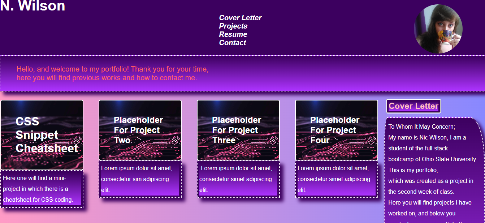

# My Portfolio

## Description
Thank you for viewing this project, I have made a site to stand as a business card for my experience. This site will show off my works so far, and will be updated in the future as my experience grows. Here you will find links to my works, and a way to contact me.

## Table of Contents
- [Installation](K#installation)
- [Usage](#usage)
- [Credits](#credits)
- [License](#license)
- [Badges](#badges)
- [Features](#features)
- [Contribute](#how-to-contribute)

## Installation

To install this code use `git clone` to clone the repository, `git status` to make sure your copy is up to date or `git pull` to update it. Here [link](https://kc-nick.github.io/This-Portfolio-of-Mine/) you can find the live site, which will appear as such when loaded: .

## Usage

To use this app, open the live site and check out the links I've placed to other projects! My Contact page contains a back button to easily switch between that and the main portfoilo.

## Credits

Credits to OSU Web Development program for providing training, and support. I would also like to acknowledge my instructor Matthew Miller, and my tutor Matthew Calimbas for the help I recieved to make my portfolio look just like I hoped.

## License

N/A

## Badges

TBA.

## Features

This app features my portfolio of projects, using the links provided on the app you can view other projects connected to it.

## How to Contribute

If you would like to contribute to this code use `git add -A` to stage files, `git commit -m "What You Changed"` to commit changed, and `git push` to push any edits to the code to Github.